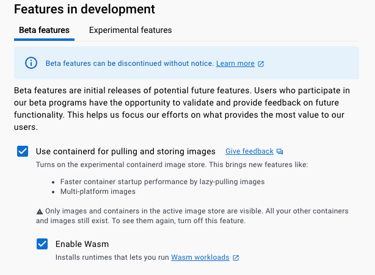
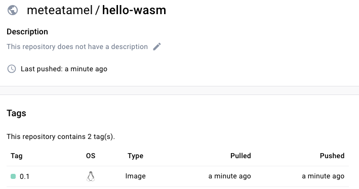

# Running Rust on Wasm in Docker

## Prerequisites

* You have Docker Desktop 4.15 or later.
* You have Rust [installed](https://www.rust-lang.org/tools/install).
* You have a Wasm runtime installed, for example
  [Wasmtime](https://wasmtime.dev/) or
  [WasmEdge](https://wasmedge.org/book/en/quick_start/install.html).

## Create, build, and run a HelloWorld app

Create:

```sh
cargo new hello-wasm
```

Build:

```sh
cd hello-wasm
cargo build
```

Run:

```sh
./target/debug/hello-wasm

Hello, world!
```

## Configure Rust to compile to Wasm

Add `wasm32-wasi` target:

```sh
rustup target add wasm32-wasi
```

## Build and run HelloWorld app in Wasm

Change `main.rs` to the following:

```rust
use std::{thread, time};

fn main() {
    println!("Hello, Wasm before!");
    let duration = time::Duration::from_secs(10);
    thread::sleep(duration);
    println!("Hello, Wasm after!");
}
```

Build for Wasm/Wasi:

```sh
cargo build --target wasm32-wasi
```

Run in a Wasm runtime such as `wasmtime`:

```sh
wasmtime target/wasm32-wasi/debug/hello-wasm.wasm

Hello, Wasm before!
Hello, Wasm after!
```

Or in `wasmedge`:

```sh
wasmedge target/wasm32-wasi/debug/hello-wasm.wasm

Hello, Wasm before!
Hello, Wasm after!
```

## Configure Docker for Wasm

Make sure Docker Desktop has `containerd` enabled.

Go to `Settings` => `Features in development` => Check: `Use containerd for
pulling and storing images`



## Wrap the Wasm app into an OCI image

Create a `Dockerfile`:

```Dockerfile
FROM scratch
COPY ./target/wasm32-wasi/debug/hello-wasm.wasm /hello-wasm.wasm
ENTRYPOINT [ "hello-wasm.wasm" ]
```

Build the image:

```sh
docker buildx build -t meteatamel/hello-wasm:0.1 .
```

Run the image locally:

```sh
docker run --rm --runtime=io.containerd.wasmedge.v1 meteatamel/hello-wasm:0.1
```

As it’s running, you can see that it’s just a regular container:

```sh
docker ps

CONTAINER ID   IMAGE                       COMMAND             CREATED         STATUS         PORTS     NAMES
1d2e3f09a9c5   meteatamel/hello-wasm:0.1   "hello-wasm.wasm"
```

Push the image to DockerHub:

```sh
docker image push meteatamel/hello-wasm:0.1
```



## References

* [Announcing Docker+Wasm Technical Preview 2](https://www.docker.com/blog/announcing-dockerwasm-technical-preview-2/)
* [Getting started with Docker + Wasm](https://nigelpoulton.com/getting-started-with-docker-and-wasm/)
* [WASM + Docker HelloWorld](https://blog.devgenius.io/wasm-docker-hello-world-2ac6a456ddd4)